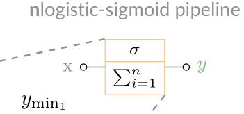
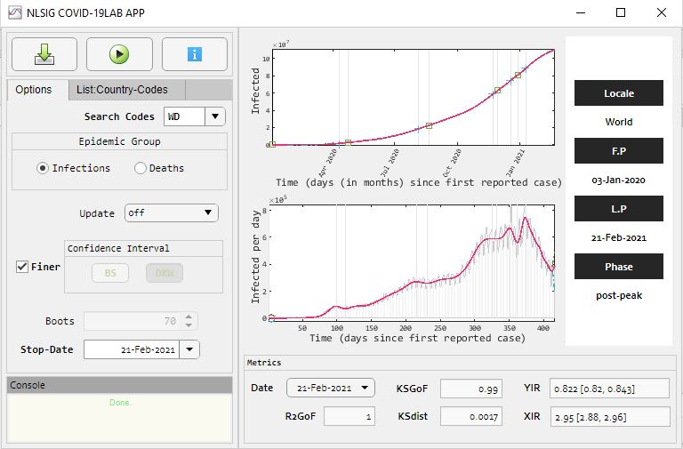
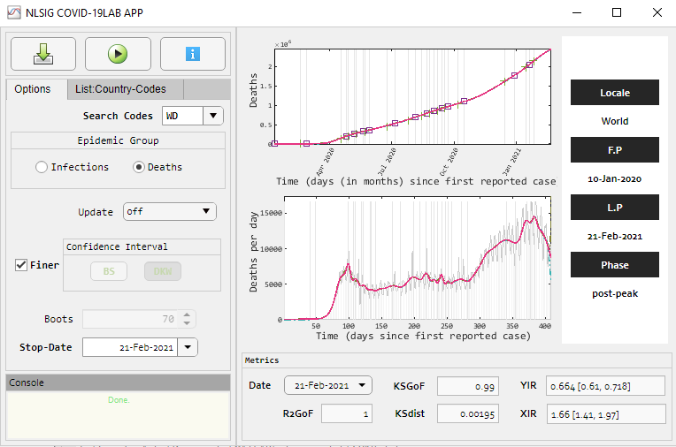
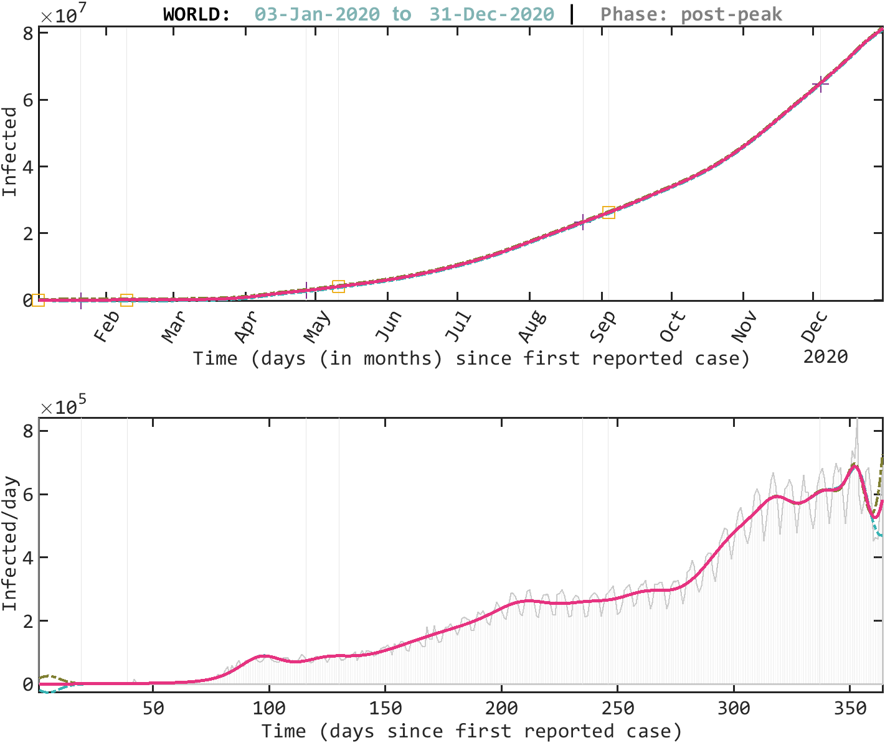
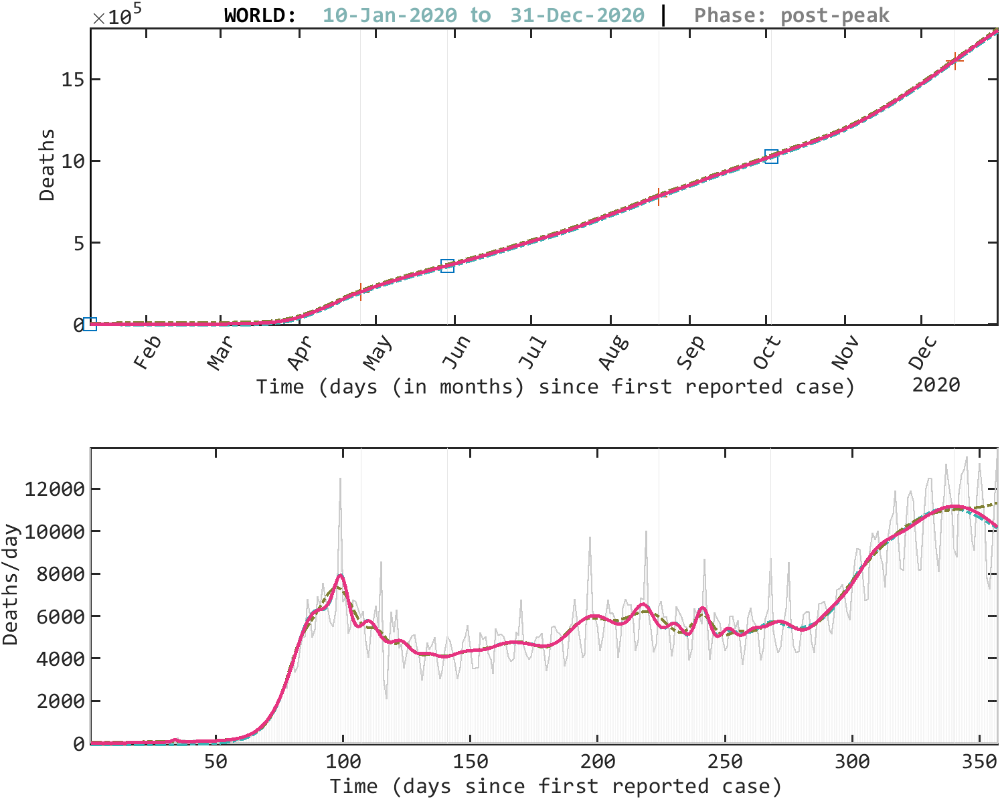
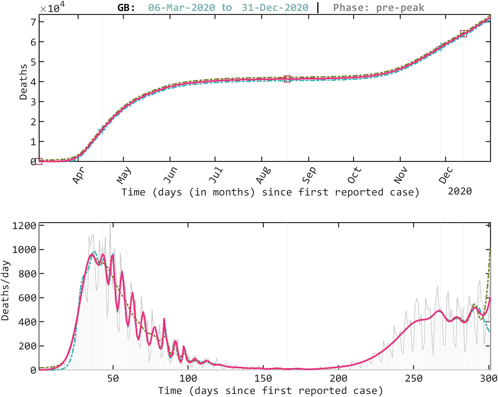
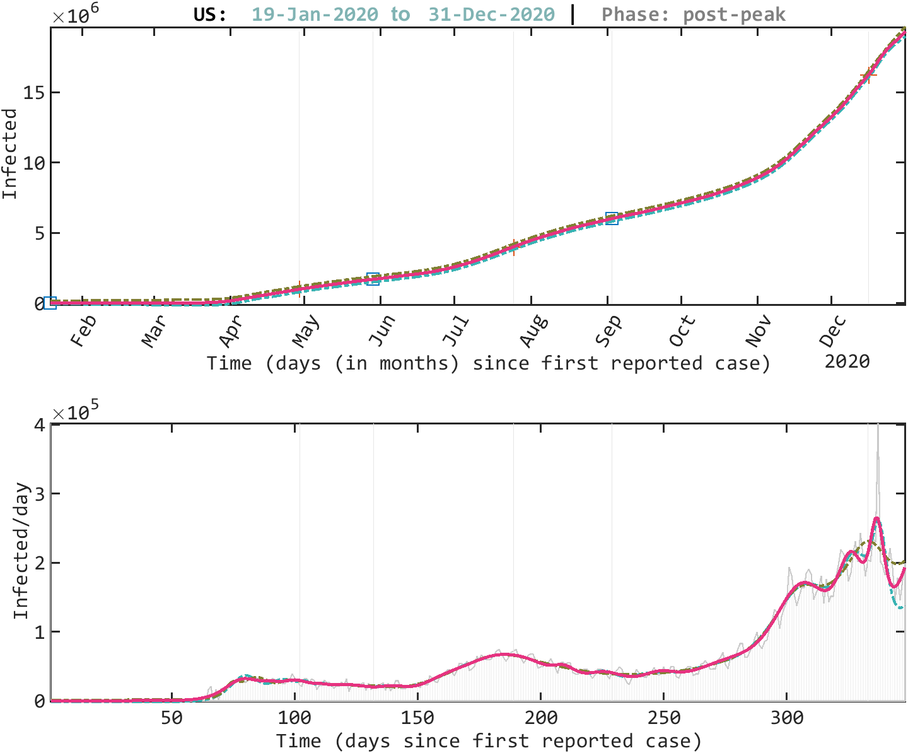
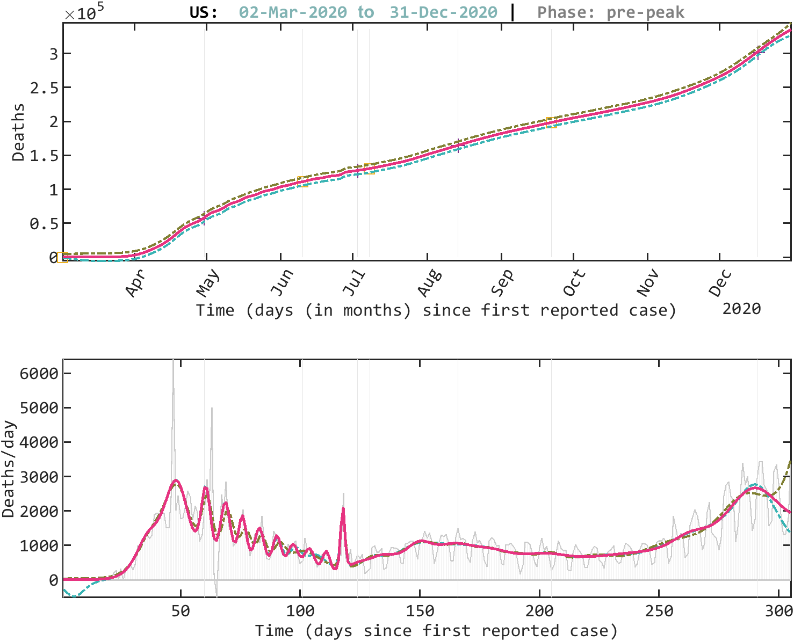
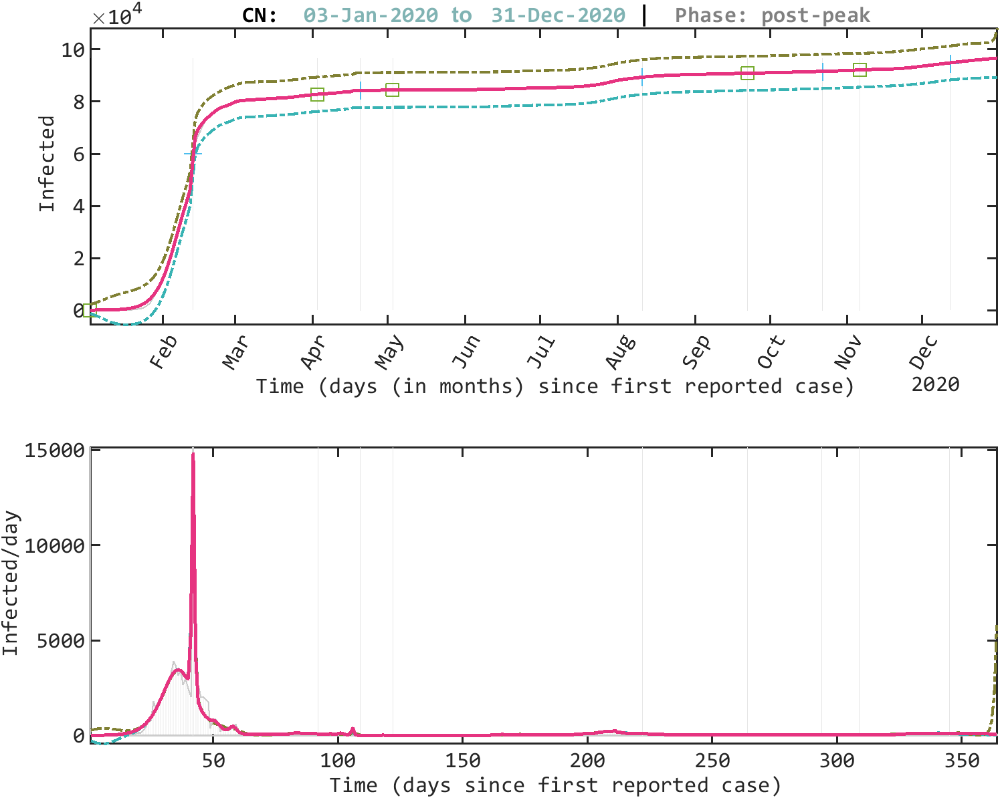
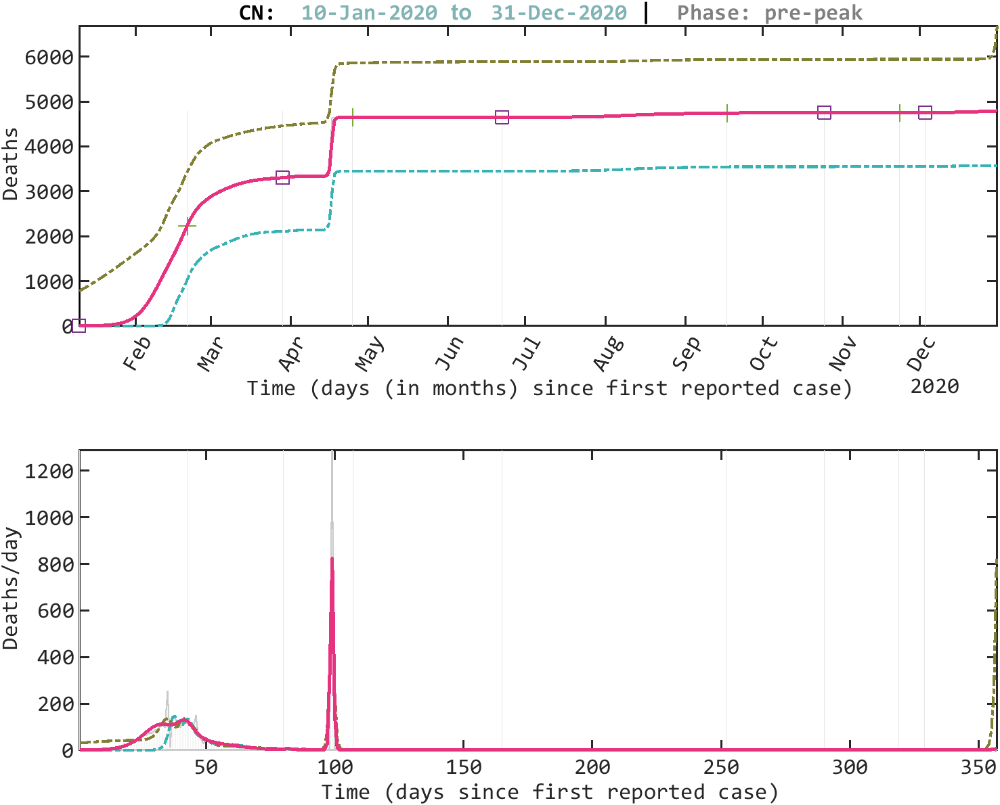

# NLSIG-COVID19Lab

A playground for descriptive modelling and monitoring the time-series COVID-19 pandemic growth with the nlogistic-sigmoid function

nlogistic-sigmoid function (NLSIG) is a modern logistic-sigmoid function definition for modelling growth (or decay) processes. It features two logistic metrics (YIR and XIR) for monitoring growth from a two-dimensional (x-y axis) perspective.

## Links
* [NLSIG-COVID19Lab Paper Draft](osspaper/10.21105.joss.02913.pdf)

* [NLSIG Conference Presentation Slides](nlsigcv19_confslide.pdf) *Best Student Paper* at the **2nd African Symposium on Big Data, Analytics and Machine Intelligence and 6th TYAN International Thematic Workshop December 3-4, 2020**.
 
* [NLSIG Preprint](https://arxiv.org/abs/2008.04210)

## Data Source
World Health Organization

## Getting Started : MATLAB

**Matlab Toolbox Requirements**
- Optimization Toolbox
- Statistics and Machine Learning Toolbox

**MATLAB Release Compatibility**
- Compatible with R2020a and later releases

**External Dependencies**
- None

### MATLAB App: Installation
Provided is a MATLAB App to allow for easy use. 

1. In the *applet folder*, double-click or right-click on the App Installer: *NLSIG-COVID19Lab.mlappinstall*

2. A confirmation dialog **Install into My Apps** pops up. Select *Install*

3. The App is then Installed, and can be accessed from the **MY APPS** section in the **APPS tab** on MATLAB's top panel or toolstrip.
**Hover** on the NLSIG-COVID19Lab App icon to see the **App details** and **install location**.

The default install location is in the Add-Ons location and is specific to the platform.
This can be viewed from the Home tab's Environment section, click **Preferences > MATLAB > Add-Ons**.

The install location then can be somewhere like this:

Windows - C:\Users\username\Documents\MATLAB\Add-Ons\Apps\NLSIGCOVID19Lab

Linux - ~/MATLAB/Add-Ons/Apps/NLSIGCOVID19Lab.

Mac - ~/Library/Application Support/MathWorks/MATLAB/Add-Ons/Apps/NLSIGCOVID19Lab

### MATLAB App: Using

Click the NLSIG-COVID19Lab App icon to start the App.

See the screenshots below

To **Start Modelling**: Click 

To **Update the Local Database**: Click 

To View Available Country-Codes: Switch to the **List:Country-codes** Tab

To Set options for Modelling: Click on the **Options** Tab
 

#### Metrics: Interpretation
As at the 21st of February 2021:

*For infections*: 

**YIR = 0.822 [0.82, 0.843]** indicates that the numbers are past the peak; 

**XIR = 2.95 [2.88, 2.96]** indicates that this time is clearly a post-peak period. 

*For deaths*: 

**YIR = 0.664 [0.61, 0.718]** indicates that the numbers are no longer increasing and are recently past the peak for this phase; 

**XIR = 1.66 [1.41, 1.97]** indicates that this time is an early post-peak period. 

## Metrics

**R2GoF** R2 Goodness of Fit

**KSGoF** Kolmogorov-Smirnov Goodness of Fit 

**KSdist** Kolmogorov-Smirnov Distance Statistic

**YIR**

`YIR < 0.5` indicates generally increasing motion of growth

`YIR ~= 0.5` indicates generally that the increase has peaked. 

`YIR > 0.5` indicates generally reducing motion of growth

`YIR ~= 0` indicates either that the growth is flattening or could be increasing. 

**XIR**

`XIR < 1` indicates a pre-peak period

`XIR ~= 1` indicates a peak-period. 

`XIR > 1` indicates a post-peak period.

`XIR ~= 0` indicates either a post-peak period or an early pre-peak. 

<!-- **Toy Example**

For infections: the YIR = 0.4916 [0.4908, 0.5063] indicates that the numbers are peaking and may start to decrease soon; the XIR = 0.9843 [0.9826, 1.0146] indicates that this time is close to a peak period. 

For deaths: the YIR = 0.4584 [0.4241, 0.5079] indicates that the numbers are still increasing but may likely peak soon; the XIR = 0.9266 [0.8634, 1.0245] indicates that this time is most-likely a peak period, close to a post-peak period. -->

## Frontend API 
Examples of Frontend APIs available for this pacakage can be found in the:

1. ``examples_m_api`` folder and 

2. ``examples_mlx_api`` folder   

<!-- 	You should see:
	'view_ccode.m'

	'upd_all.m'

	'query_single.m'

	'query_batch.m'

	'query_all.m'

	First, it is recommended to start with 'query_single.m'. 
	The country code for the world here is ``WD``.

	### 'view_ccode.m'
	View all country codes.
	Example: type ``view_ccode`` in the command window.

	### 'upd_all.m'
	Update data on the COVID-19 pandemic for all country codes. This needs
	a good internet connection.
	Example: type ``upd_all`` in the command window.

	### 'query_single.m'
	Query COVID-19 pandemic for selected country code.

	### 'query_batch.m'
	Query COVID-19 pandemic for a batch of selected country codes.

	### 'query_all.m'
	Query COVID-19 pandemic for all country codes. -->

## Saved Results
Saved model fit results and logistic metrics for infections and deaths can be found in the *assets* folder and *measures* folder

### *assets* folder
Stores all graphics for the model fit of infections and deaths in a folder named by the last date time-stamp in the data. 
Graphics are individually saved using the country code. 

For example: ``WDi.pdf`` and ``WDd.pdf`` respectively indicates the
saved graphics of the COVID-19 infections and deaths model fit for the World to the last date time-stamp in the data in pdf format.

### *measures* folder
Stores all estimated logistic metrics for infections and deaths till 
the last date time-stamp in the data in the *infs* and *dths* 
subfolders respectively.
	
## Automated Tests
Automated Tests for the app and package functionalties can be found in the *tests* folder.
	
<!-- #### Example
 --><!-- Running 'query_single.m' with the search_code as ``WD``
gave the following model fit for the ongoing COVID-19 pandemic with respect to the last updated date of the data. -->

<!-- **WORLD COVID-19 Infections**

 

**WORLD COVID-19 Deaths**

**UK COVID-19 Infections**

 

**UK COVID-19 Deaths**

**USA COVID-19 Infections**

 

**USA COVID-19 Deaths**

**CHINESE COVID-19 Infections**

 

**CHINESE COVID-19 Deaths**

 -->

<!--#### Recovered-->

 
## Miscellanous
If interested in dedicating the time to port to other languages, 
please contact me, by creating a [new issue](https://github.com/somefunAgba/NLSIG-COVID19Lab/issues/new/choose).

## License
This work is free software under the [BSD 3-Clause "New" or "Revised" License](https://github.com/somefunAgba/NLSIG-COVID19Lab/blob/main/LICENSE) 

## (Optional) Citation Details
*Author*: Oluwasegun Somefun, Kayode F. Akingbade and Folasade M. Dahunsi

*Title*: On the nlogistic-sigmoid modelling for complex growth processes: in application to the COVID-19 pandemic

*Conference*: 2nd African Symposium on Big Data, Analytics and Machine Intelligence and 6th TYAN International Thematic Workshop on Data Science for Solution-driven and Sustainable Response to current developing world challenges.

*Date*: December 3, 2020

