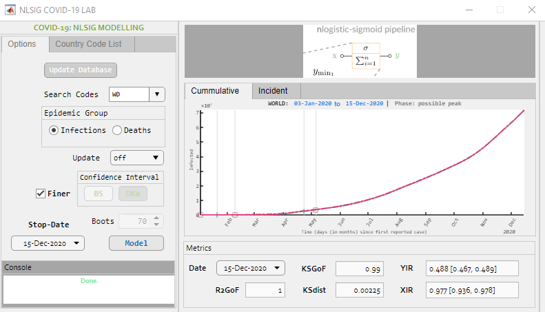
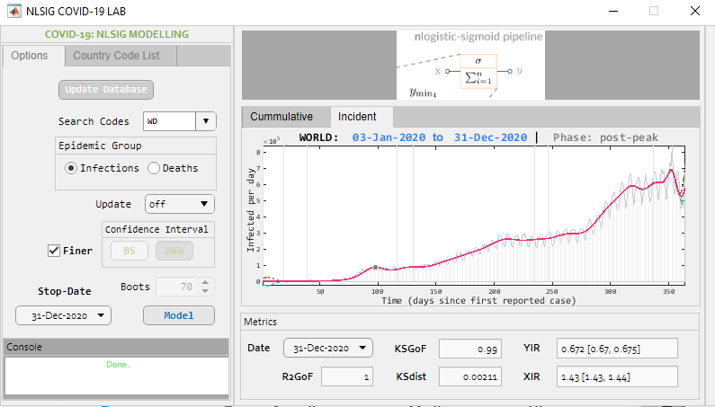

# NLSIG-COVID19Lab

A playground for modelling and monitoring the time-series COVID-19 pandemic growth with the nlogistic-sigmoid function

nlogistic-sigmoid function (NLSIG) is a modern logistic-sigmoid function definition for modelling growth (or decay) processes. It features two logistic metrics (YIR and XIR) for monitoring growth from a two-dimensional (x-y axis) perspective.

## Links
* [NLSIG Conference Presentation Slides](https://github.com/somefunAgba/NLSIG-COVID19Lab/blob/main/nlsigcv19_confslide.pdf) *Best Student Paper* at the **2nd African Symposium on Big Data, Analytics and Machine Intelligence and 6th TYAN International Thematic Workshop December 3-4, 2020**.
 
* [NLSIG Preprint](https://arxiv.org/abs/2008.04210)

## Data Source
World Health Organization

## Getting Started : MATLAB

### GUI
First, provided is a MATLAB APP to allow for easy use.

### API 
Although, uses the same source as the GUI, this is a script-based application-interface and entirely distinct from the MATLAB APP. Procedure for use are outlined as follows:

1. Run 'su.m' to add all the project folders and files to MATLAB's path
   or type ``su`` in the command window

2. Open the 'ui' folder to see possible user interaction with the lab's api.

	You should see:
	'view_ccode.m'

	'upd_all.m'

	'query_single.m'

	'query_batch.m'

	'query_all.m'

	First, it is recommended to start with 'query_single.m'. 
	The country code for the world here is ``WD``.

	### 'view_ccode.m'
	View all country codes.
	Example: type ``view_ccode`` in the command window.

	### 'upd_all.m'
	Update data on the COVID-19 pandemic for all country codes. This needs
	a good internet connection.
	Example: type ``upd_all`` in the command window.

	### 'query_single.m'
	Query COVID-19 pandemic for selected country code.

	### 'query_batch.m'
	Query COVID-19 pandemic for a batch of selected country codes.

	### 'query_all.m'
	Query COVID-19 pandemic for all country codes.

3.	To view saved model fit results and logistic metrics for infections and deaths. 
	Open the 'assets' folder and 'measures' folder

	### 'assets' folder
	Stores all graphics for the model fit of infections and deaths in a folder 
	named by the last date time-stamp in the data. 
	Graphics are individually saved using the country code. 

	For example: 'WDi.pdf' and 'WDd.pdf' indicates the
	COVID-19 infections and deaths model fit graphics for the World 
	to the last date time-stamp in the data.

	### 'measures' folder
	Stores all estimated logistic metrics for infections and deaths till 
	the last date time-stamp in the data in the 'infs' and 'dths' 
	subfolders respectively.
	
	
## Example
Running 'query_single.m' with the search_code as ``WD``
gave the following model fit for the ongoing COVID-19 pandemic with respect to the last updated date of the data.

#### WORLD COVID-19 Infections

 

#### WORLD COVID-19 Deaths

#### CHINESE COVID-19 Infections

 

#### CHINESE COVID-19 Deaths

#### USA COVID-19 Infections

 

#### USA COVID-19 Deaths

#### Metrics Interpretation: 

**YIR**

`YIR < 0.5` indicates generally increasing motion

`YIR ~= 0.5` indicates generally that the increase has peaked. 

`YIR > 0.5` indicates generally reducing motion

**XIR**

`XIR < 1` indicates a pre-peak period

`XIR ~= 1` indicates a peak-period. 

`XIR > 1` indicates a post-peak period.

`XIR ~= 0` indicates either a post-peak period or an early pre-peak. 

**Example**

For infections: the YIR = 0.4916 [0.4908, 0.5063] indicates that the numbers are peaking and may start to decrease soon; the XIR = 0.9843 [0.9826, 1.0146] indicates that this time is close to a peak period. 

For deaths: the YIR = 0.4584 [0.4241, 0.5079] indicates that the numbers are still increasing but may likely peak soon; the XIR = 0.9266 [0.8634, 1.0245] indicates that this time is most-likely a peak period, close to a post-peak period.

<!--#### Recovered-->

 
## Miscellanous
If interested in dedicating the time to port to other languages, 
please contact me.

## License
This work is free software under the [BSD 3-Clause "New" or "Revised" License](https://github.com/somefunAgba/NLSIG-COVID19Lab/blob/main/LICENSE) 

## (Optional) Citation Details
*Author*: Oluwasegun Somefun, Kayode F. Akingbade and Folasade M. Dahunsi

*Title*: On the nlogistic-sigmoid modelling for complex growth processes: in application to the COVID-19 pandemic

*Conference*: 2nd African Symposium on Big Data, Analytics and Machine Intelligence and 6th TYAN International Thematic Workshop on Data Science for Solution-driven and Sustainable Response to current developing world challenges.

*Date*: December 3, 2020

