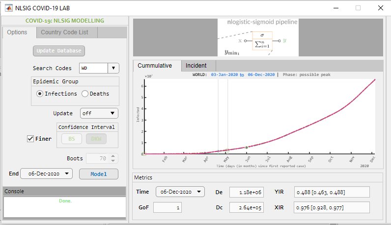
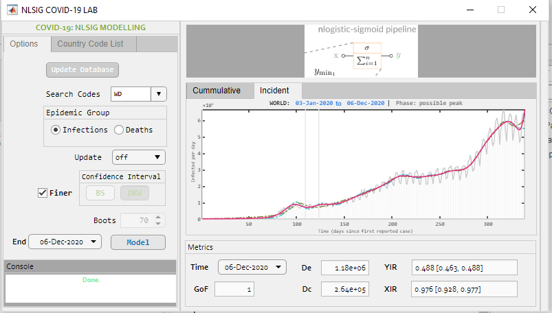

# Summary

The growth (flow or trend) dynamics in any direction for most natural phenomena such as: epidemic spreads, population growths, 
adoption of new ideas, and many more, can be approximately modelled by the logistic-sigmoid curve. 
In particular, the logistic-sigmoid function with time-varying parameters is the core trend 
model in Facebook's Prophet model for time-series growth-forecasting 
at scale [@taylorForecastingScale2018] on big data. 
The scientific basis for this prevalence is given in [@bejanConstructalLawOrigin2011]. 
Such growth-processes can be viewed as complex input--output systems that involve 
multiple peak inflection phases with respect to time. An idea that 
can be traced back in the crudest sense to [@reedSummationLogisticCurves1927]. A modern definition for the logistic-sigmoid growth which considers restricted growth from  a two-dimensional perspective is the nlogistic-sigmoid function (`NLSIG`) [@somefunLogisticsigmoidNlogisticsigmoidModelling2020] 
or logistic neural-network (`LNN`) pipeline. 

In this context, `NLSIG-COVID19Lab` functions as a `NLSIG` playground for modelling 
the COVID-19 epidemic growth in each affected country of the world and the world as a whole. 

# Statement of need

Admittedly, epidemiological models such as the SEIRD variants 
[@leeEstimationCOVID19Spread2020;@okabeMathematicalModelEpidemics2020] are just another form of representing sigmoidal growth [@xsRichardsModelRevisited2012]. It has been noted in 
[@christopoulosNovelApproachEstimating2020] that the SEIRD-variant models yield largely exaggerated forecasts. 
Observing the current state of the COVID-19 pandemic, this is also true, as regards, 
the results of various applications of logistic modelling [@batistaEstimationStateCorona2020;@wuGeneralizedLogisticGrowth2020]
which have largely resulted in erroneous identification of the epidemic's progress and its future projection, hence leading policymakers astray [@matthewWhyModelingSpread2020]. 

Notably, two recurring limitations of the logistic definitions in the literature and other software packages exist. A trend that has continued since the first logistic-sigmoid function introduction [@bacaerVerhulstLogisticEquation2011]. 

First is that, the co-domain of logistic function is assumed to be infinite. This assumption violates the natural principle of finite growth. 
Second is that, during optimization, the estimation of the logistic hyper-parameters  for the individual logistic-sigmoids that make the multiple logistic-sigmoid sum is computed separately, instead of as a unified function. The effect of this, is that, as the number of logistic-sigmoids 
considered in the sum increases, regression analysis becomes more cumbersome and complicated as can be observed in these works [@leeEstimationCOVID19Spread2020;@batistaEstimationStateCorona2020;
@hsiehRealtimeForecastMultiphase2006;@wuGeneralizedLogisticGrowth2020;
@chowellNovelSubepidemicModeling2019;@taylorForecastingScale2018]. 

These limitations are efficiently overcome by the nlogistic-sigmoid function (or logistic neural-network pipeline) `NLSIG` for describing logistic growth. The `NLSIG` is a logistic neural-network machine-learning tool under active development. The benefits it provides at a functional level:
	
 - unified function definition
 
 - functional simplicity and efficient computation
	
 - improved nonlinear modelling power
		
The development of the `NLSIG-COVID19Lab` was motivated largely by research needs to 
illustrate the power of the nlogistic-sigmoid neural pipeline. `NLSIG-COVID19Lab` provides an optimization workflow with functions to make modelling and monitoring the COVID-19 pandemic easier and reliable. Notably, instead of engaging in false prophecy 
or predictions on the cumulative growth of an ongoing growth phenomena, whose source is both uncertain and 
complex to be encoded in current mathematical models [@christopoulosEfficientIdentificationInflection2016;@matthewWhyModelingSpread2020], on the contrary, this software package make projections by means of:

-  a two-dimensional perspective in form of two metrics (YIR and XIR) for robust monitoring of the growth-process being modelled in an area or locale of interest. 

- adaptation of the Dvoretzky–Kiefer–Wolfowitz (DKW) inequality for the Kolmogorov–Smirnov (KS) test to construct a confidence interval of uncertainty on the nlogistic-sigmoid model with a 99% (1-0.01) probability by default. 

`NLSIG-COVID19Lab` is useful as a quick real-time monitoring tool for the COVID-19 pandemic. It was designed to be used by humans, both researchers and non-reserachers. 

`NLSIG-COVID19Lab` is currently written in MATLAB but will be implemented in other languages in the future. 
 
The user-client end (both user application scripts and graphical user interface) of the `NLSIG-COVID19Lab` 
is designed to provide a user-friendly interface demonstrating the `NLSIG` modelling power for time-series growth processes from data. 
In this case, the growth-process is the time-series COVID-19 pandemic growth from official datasets (see \autoref{fig:wdcgui} and \autoref{fig:wdigui}).

{ width=70% } 

{ width=70% }

### Core Data Source
As at the time of writing. The COVID-19 Database of `NLSIG-COVID19Lab` is sourced from the:

* World Health Organization

* Center for Systems Science and Engineering at the Johns Hopkins University.

<!-- # Mathematics

Single dollars ($) are required for inline mathematics e.g. $f(x) = e^{\pi/x]$

Double dollars make self-standing equations:

$$\Theta(x) = \left\{\begin{array]{l]
0\textrm{ if ] x < 0\cr
1\textrm{ else]
\end{array]\right.$$

You can also use plain \LaTeX for equations
\begin{equation]\label{eq:fourier]
\hat f(\omega) = \int_{-\infty]^{\infty] f(x) e^{i\omega x] dx
\end{equation]
and refer to \autoref{eq:fourier] from text.
 -->

# Related research and software

To the best of knowledge, we are unaware of other software packages or tool with a similar purpose.

This application of the `NLSIG` to modelling the COVID-19 pandemic was selected as the best paper at the *2nd African Symposium on Big Data, Analytics and Machine Intelligence and 6th TYAN International Thematic Workshop, December 3-4, 2020*.

# Acknowledgements

This work received no funding. 

# References